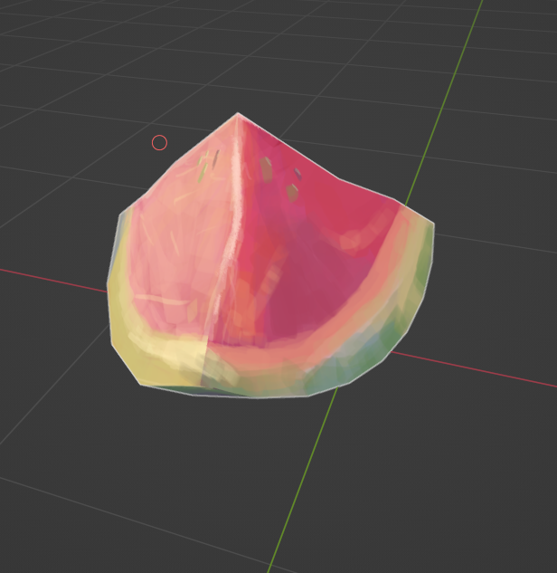
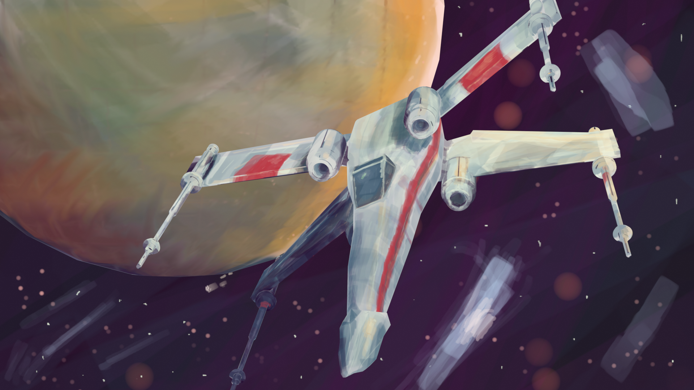
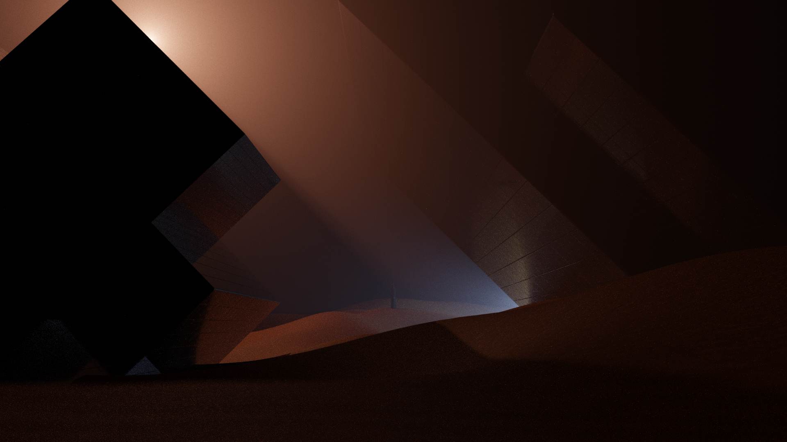
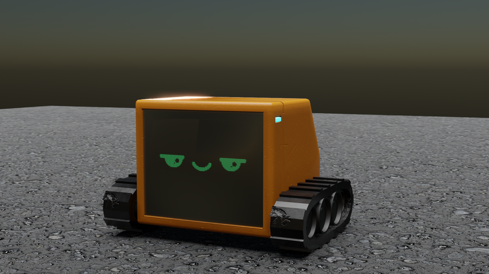
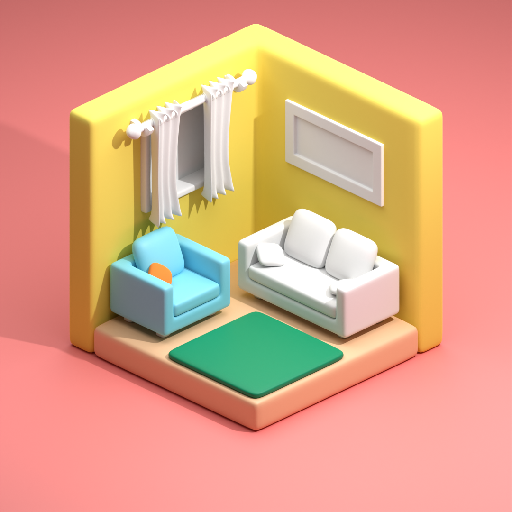
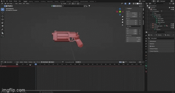

# Blender-Work
 A collection of my blender work. Past and on going

Mainly consists of hard surface modeling. These are exercises to learn more about the 3d content creation pipeline. 
  
Here are some examples:  

## Texture Painting:
      
This was an introduction to texture painting and my first time using a drawing tablet. I was influenced by Arcane's artstyle and watching Spiderverse.

I did some further work with a study on water melon and a full scene with an x-wing. I find it useful to use the render preview in order to gauge how the light and shadow should be painted.
      

## Cubes:
  
For this image, I wanted to try using a wide variety of materials including glass while improving my composition and lighting.   

 ## Venom in a bottle:  
  
 With this scene, I learned the basics of sculpting. I mainly used the snake hook and smoothing brushes. Additionally, it was an opportunity to refine my hard-surface modeling skills while creating the blockout and the bottle.
 
 ## Desert Planet:  
  
 This render taught me the basics of navigating within blender as well as using simple shapes to make interesting visual.   
 
 ## Robot buddy:  
  
 This render taught me the basics for character design in addition to material workflows. 

 ## Room
   
 Although I am still working on it, this scene taught me the versatility of modifiers and working with the camera
 
 ## Pistol
   
 This application was for a game that I'm making within unity. It introduced me to keyframe animation within blender through using a timeline sequencer and the action editor. (Check out the video for a better fps/resolution)
