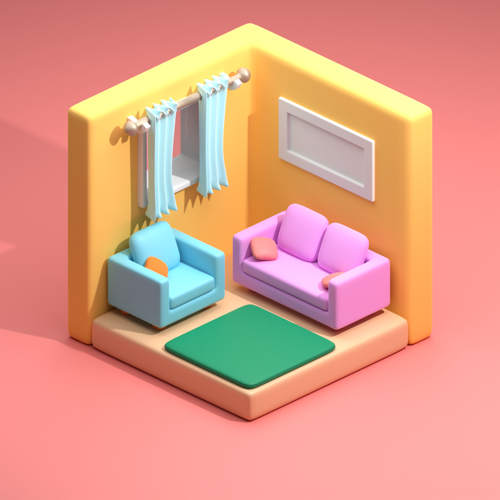

# Blender-Work
 A collection of my blender work. Past and on going

Mainly consists of hard surface modeling. These are exercises to learn more about the 3d content creation pipeline. 
  
Here are some examples:  

## Glass Dispersion
By adding refraction shaders with different IOR, I was able to achieve an interesting glass material. Combining with a glass BRDF made for a fun lighting challenger.   
 

https://github.com/user-attachments/assets/a6b2b9d3-5b3a-481a-8164-0cb690965eb3

## Fluid Knight
I wanted to explore more of Houdini's simulation worklfow and combine it with a glossy aesthetic. I created a flip sim by converting my knight mesh to a vdb and remeshing back to act as the collider. From there, I added an emmitter to obtain the flip particle output. To finilize it, I created a mesh from the particle points. Adding a transparent material and glossy shader to knight led me to interesting visualise. The high reflectance led to me putting more effort into the lighting but gave it a really cool look that I want to explore more. In the end, I'm happy with the a cool render I came out with and the added new Houdini knowledge :)

  

## Soulless

These vfx shots were done for musician Nyota Parker for her music video of the song [Soulless](https://www.youtube.com/watch?v=HO8XB8nNnrM&ab_channel=NyotaParkerVEVO). I started using an EXR workflow to allow for further flexibility in the composite stage.
The first shot was a fully cg shot of the story book pages flipping to reveal the witch's castle. I worked hard texturing the book itself and creating a shader to mimic old paper. Additionally, I did a cloth simulation for when the book opens on the table. To finish off the shot, I added volumetrics, a dust particle system and gobos to accent the lighting. 

   

Next I worked on the thought bubble shot. I created a volume from a simple mesh and added various size of noise as displacement to get different levels of detail. I then animated this noise to get the contained movement. In order to create the mask, I created a material to tell proximity to the surface and rerendered the sequence.   

    

The last shot involved a portal. For this, I created a looping smoke simulation by overlapping the sim with itself. With the use of clever masks, I was also able to make it seemless. From there, I mapped it to a cylindrical mesh. By layering this effect and adding particles, here is the result I was able to achieve.  

   

## Eternal Ascent

This part of an animation I'm working on within unreal. It's for pwnisher's 3d render challenge. As part of the scene, I have a cathedral that get's struck by energy. I already had the asset so I took it upon myself to learn how to animate with drivers. I split the model and did some parenting to end up with this

https://github.com/FrankfurtOceanic/Blender-Work/assets/83598831/06a2c34c-a7bb-4a6d-8418-c13347ac1f31

## Valentine's Day

This was an animation I did for my girlfriend. This was my first time using mocap! I used rokoko video to generate the the motion. Afterwards, I retargeted to my skeleton and cleaned up the animation. 

https://github.com/FrankfurtOceanic/Blender-Work/assets/83598831/68a9830d-2f18-4b8e-9098-2cd3941d673c

I got to know Blender's hair and grooming systems to make the character. 

 

Lastly, I did a bit of "Vehicle" type rigging to get the cart to move well. 

https://github.com/FrankfurtOceanic/Blender-Work/assets/83598831/c36e463c-2e76-46e1-a7d8-c06d9b9f2689

## Furballs:

https://github.com/FrankfurtOceanic/Blender-Work/assets/83598831/8c97e144-6206-4294-bdbe-7eec09361e6f  

I experimented using clothsims with pressures and internal springs as well as hair systems to create a satifying render. This is also the first time I frame the shot in portrait mode (intended for mobile viewing). This is by far the longest render I've had. It's given me motive to find ways of speeding up renders for animations and hair systems.
## Rigidbody motion graphics:

https://github.com/FrankfurtOceanic/Blender-Work/assets/83598831/1c13cade-62c9-4b54-9c2b-92ecb1a77324

I learned how to control rigidbodies using forces as well as adding colliders. The popping effect was achieved by making objects very small and scaling them back to normal in 1 frame. This scene also helped me get a better control of lighting setups and my camera setup.

## Yggdrasil:

 
For this piece, I tried to become more comfortable with transparent materials. I used volumetrics for the background and tree leaves. Additionally, I used a refractive glass shader for the trunk and branches. Inside each branch, I added an emissive vein that represents the energy coursing through the tree. A particle system was used to create the stars.

## Hyper Light Difter:

https://github.com/FrankfurtOceanic/Blender-Work/assets/83598831/f0b581a2-7ee2-44de-aca9-feb919fee125  

This was my submision to pwnisher's boss fight 3d render challenge. I modelled, rigged, textured, and animated everything myself. I learned a lot along the way and I am proud of the progress I made as an artist.

## Flower:
 
For this render I learned how use Blender's hair particle system. Additionally, I refined my ability to light the subject in an interestingw way for a satifying render.

## Wizard Boy:
 
I tried scultping a stylized character but still using realistic materials. I got more comfortable scultping clothes. I'll hopefully rig him soon :)

## Mountain Keep: 
  
This taught me a lot about composition and materials. 

## Texture Painting:
      
This was an introduction to texture painting and my first time using a drawing tablet. I was influenced by Arcane's artstyle and watching Spiderverse.

I did some further work with a study on water melon and a full scene with an x-wing. I find it useful to use the render preview in order to gauge how the light and shadow should be painted. 

      

## Cubes:
  
For this image, I wanted to try using a wide variety of materials including glass while improving my composition and lighting.   

 ## Venom in a bottle:  
  
 With this scene, I learned the basics of sculpting. I mainly used the snake hook and smoothing brushes. Additionally, it was an opportunity to refine my hard-surface modeling skills while creating the blockout and the bottle.
 
 ## Desert Planet:  
  
 This render taught me the basics of navigating within blender as well as using simple shapes to make interesting visual.   
 
 ## Robot buddy:  
  
 This render taught me the basics for character design in addition to material workflows. 

 ## Room
   
 Although I am still working on it, this scene taught me the versatility of modifiers and working with the camera
 
 ## Pistol
   
 This application was for a game that I'm making within unity. It introduced me to keyframe animation within blender through using a timeline sequencer and the action editor. (Check out the video for a better fps/resolution)
